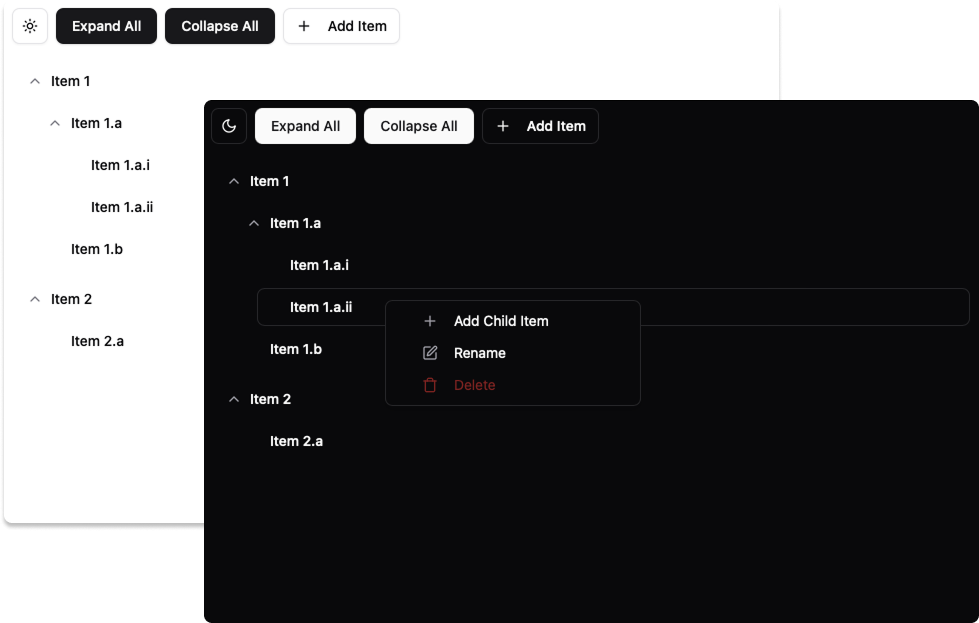
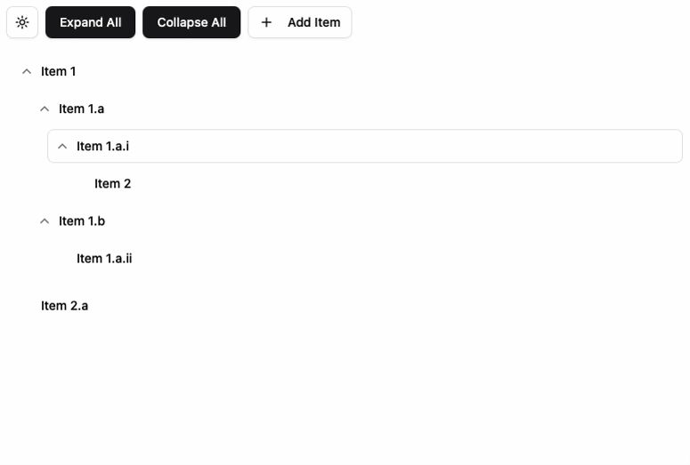
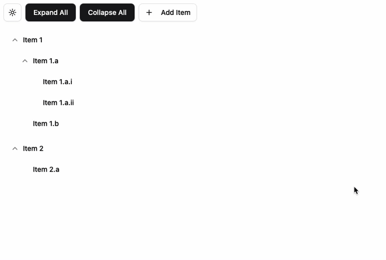
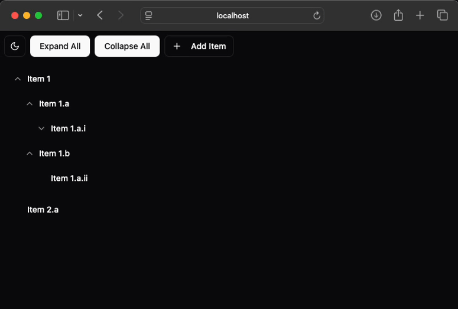

# Tree View App



This app was built using **Docker**, **PostgreSQL**, and **Node.JS**. The backend is an **Express.JS** API and the frontend is a **React** app built with **Vite** and using **TailwindCSS**, **shadcn/ui**, and **dnd kit** for styling and UI functionality.

## Features

### Items can be created, removed, and renamed.


### Items can also be dragged to change their heirarchy.


### They are also collapsable. Their collapsed state persists during session.


## Usage

```sh
docker-compose up --build
```

### Cleanup

```sh
docker-compose down -v
```

### Building UI only

```sh
cd app/client
npm install
npm run build
```

### Running Server only

```sh
# optionally build the client
cd app/client
npm install
npm run build
cd ..

npm install
npm start
```
